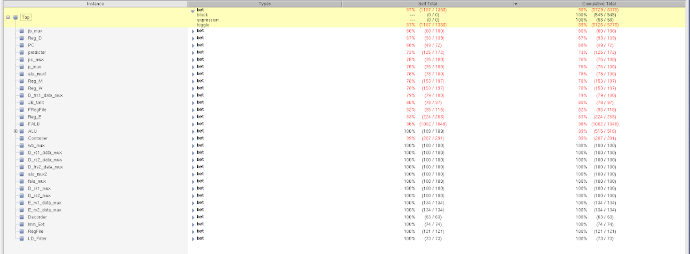

# 5-Stage Pipelined RISC-V CPU  
*with IEEE-754 FPU, Booth Multiplier, and Branch Predictor*

> **Course:** VLSI System Design &nbsp;|&nbsp; **Target ISA:** RV32I / RV32F / RV32M  
> **Flow:** RTL → Synthesis → Place-and-Route → GDSII  

---

## 1. Overview
This project implements a classic 5-stage pipeline (IF → ID → EX → MEM → WB) and extends it with:

- **IEEE-754 Single-Precision FPU**
- **Radix-2 Booth Multiplier**
- **2-bit Bimodal Branch Predictor**
- **Hazard Detection & Forwarding**

A complete ASIC flow is demonstrated using **SuperLint**, **Synopsys Design Compiler**, **ICC2**, and layout verification tools. All RTL is written in Verilog - SystemVerilog.

---

## 2. Key Features
| Category | Details |
|----------|---------|
| **Pipeline** | 5 stages, fully interlocked, bypass paths for ALU & FPU |
| **FPU Ops** | `FLW / FSW / FADD.S / FSUB.S / FMUL.S / FMIN.S / FMAX.S / FEQ.S / FLT.S / FLE.S / FCVT.W.S / FCVT.WU.s / FCVT.S.W / FCVT.S.WU / FMV.X.W / FMV.X.W |
| **Integer ALU** | Full RV32I + (`MUL`) | 
| **Branch Predictor** | one level bimodal predictor |
| **Multiplier** | booth algorithm |
| **Verification** | Custom testbench, 100 % block & expression coverage , 89 % toggle |
| **Flow** | Lint → Compile → P&R → DRC/LVS → **GDS** output |

---

## 3. Architecture

*Figure – High-level datapath; red bars mark the IF, ID, EX, MEM and WB stage boundaries.*

| Stage | Major Blocks (see diagram) | Purpose |
|-------|---------------------------|---------|
| **IF** | **PC**, **IM** (Instruction Memory), **Branch Predictor** | Fetch next instruction, generate predicted PC. |
| **ID** | **Decoder**, **Imm Ext**, **Reg File**, **FReg File** | Decode opcode / funct; read integer and floating-point registers; sign/zero-extend immediates. |
| **EX** | **ALU**, **FALU**, **Booth Multiplier**, **JB Unit** | Integer ALU ops, IEEE-754 FP ops, signed multiplication, branch/jump target calculation. |
| **MEM** | **DM** (Data Memory), **LD Filter** | Perform load/store; adjust byte/half-word loads via LD Filter. |
| **WB** | Write-back muxes (integer & FP) | Commit results to `RegFile` / `FRegFile`. |

Additional datapath features:

- **Forwarding paths** (blue/red wires) minimise data hazards.
- **Controller logic** (not shown) generates stall / flush signals and multiplexer selects.
- **Split IM/DM memories** eliminate structural hazards between fetch and data access.
---

## 4. Verification
- prog00: Integer Core Test – RV32I arithmetic / logic

- prog01: System-level Programs – Merge-sort

- prog02: Fibonacci

- prog03: Floating-Point Test – RV32F load/store

- prog04: Multiply Test (prog4) – RV32M MUL stress-test

- All programs write results to data memory; a Python test-harness compares against golden values and prints simulation pass on success.

---

## 5. Results
### 5.1 Lint & Coverage

- SuperLint	0 blocking errors

- Block Coverage	100 %
- Expression Coverage	100 %
- Toggle Coverage	89 %

### 5.2 ⇨ Synthesis Results (placeholder)

Clock period	<!-- 14 ns -->	Target = 14 ns (≈ 71 MHz)
- Setup Slack	<!-- > 0.27 ns -->

- Hold Slack	<!-- > 0 ns -->

- Cell Area	<!-- 576288 µm² -->

- Total Power	<!-- 15.4877 mW -->

###　5.3 ⇨ Layout Results
- layout result:

- pin diagram:

- layout area:

---

## 6. Future Work ⭐
Cache Integration – A basic cache module has been prototyped but is not yet connected to the CPU pipeline. 

Future steps:
Add AXI-lite wrapper between cache and memories
Insert stall logic for cache miss penalties
Re-run timing and area analysis with caches enabled

---

## 7. References
VLSI System Design – Course Lecture Notes

Computer Organization – Course Lecture Notes

RISC-V ISA Specification
